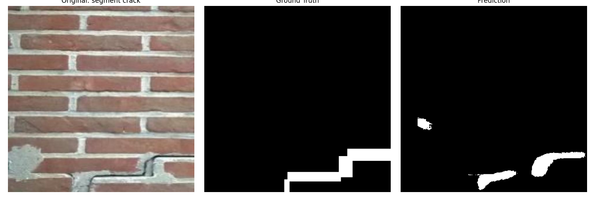
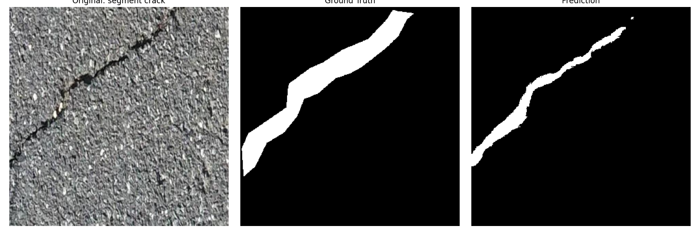
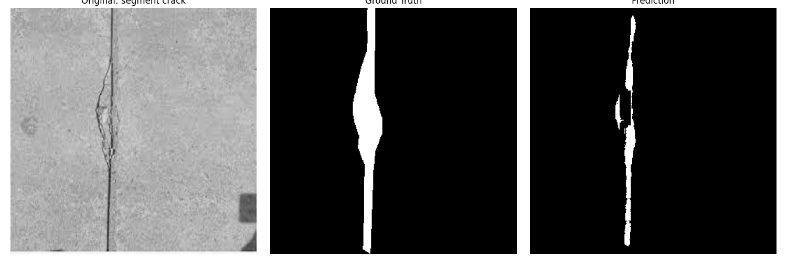
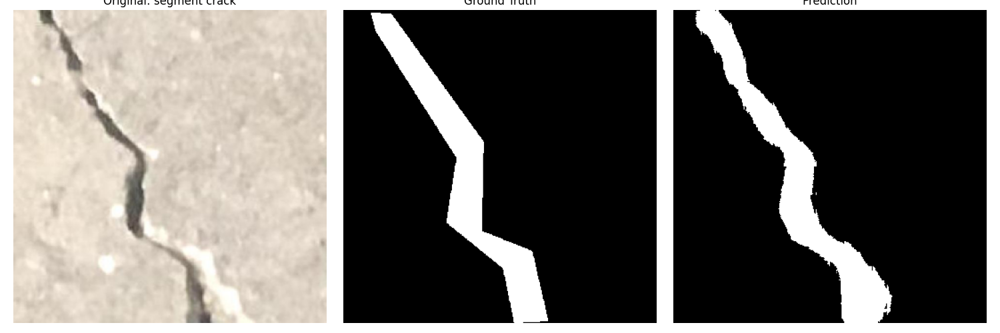
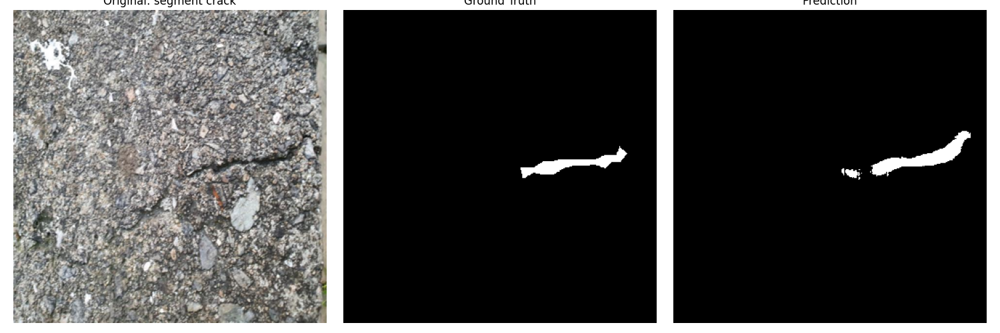
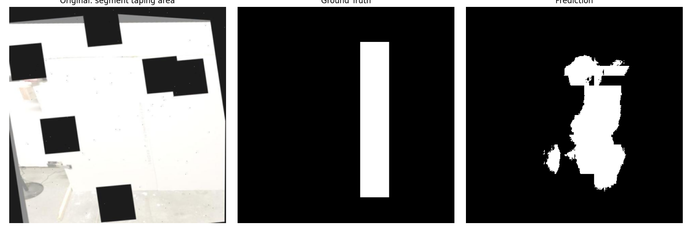
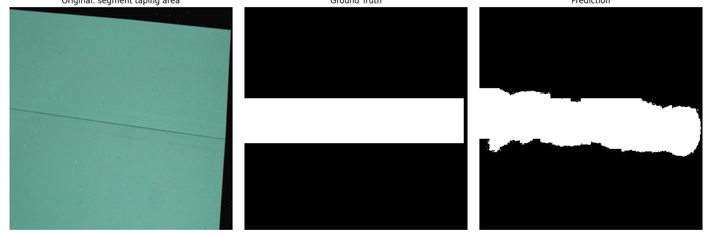
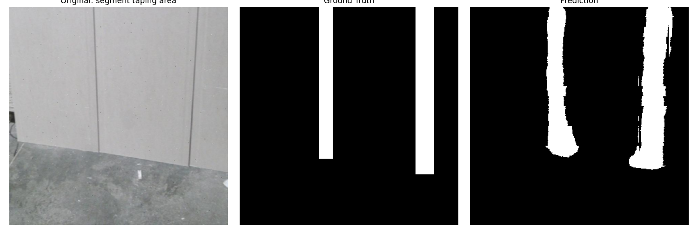
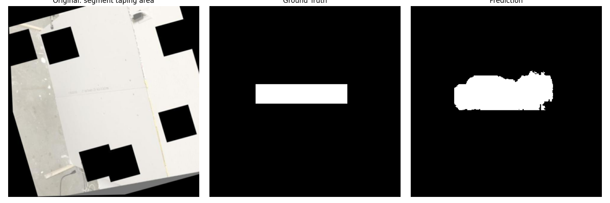
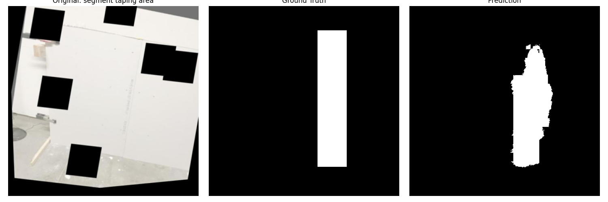

# Project Report: Prompted Segmentation for Drywall QA

## Approach & Model
We employed **CLIPSeg** (`CIDAS/clipseg-rd64-refined`), a transformer-based model designed for text-conditioned image segmentation. 
-   **Why CLIPSeg?**: It naturally handles the requirement of "image + text prompt -> mask" without needing separate heads for different classes. It leverages the semantic knowledge of CLIP.
-   **Fine-tuning**: We fine-tuned the decoder of CLIPSeg on the combined dataset of Drywall Joints and Cracks to adapt it to the specific domain of construction defects.

## Goal Summary
The goal was to produce binary masks for:
1.  **"segment crack"**: Identifying cracks in walls.
2.  **"segment taping area"**: Identifying drywall joints/seams.

## Data
-   **Dataset 1 (Drywall)**: ~1000 images (converted from BBox to Mask).
-   **Dataset 2 (Cracks)**: ~6600 images (Polygon masks).
-   **Total Train**: ~7600 images.
-   **Total Val**: ~400 images.

## Metrics (Epoch 10)
| Metric | Overall | Segment Crack | Segment Taping Area |
| :--- | :--- | :--- | :--- |
| **mIoU** | **0.5899** | 0.4536 | 0.6297 |
| **Dice Score** | **0.7421** | 0.6241 | 0.7727 |
| **Validation Loss** | **0.1168** | - | - |

## Visual Examples (Epoch 10)

### 1. Segment Crack
**Left**: Original | **Middle**: Ground Truth | **Right**: Prediction

### 2. Segment Taping Area
**Left**: Original | **Middle**: Ground Truth | **Right**: Prediction

## Reproducibility
-   **Random Seed**: Default (Random).
-   **Environment**: PyTorch on CPU/MPS.
-   **Dependencies**: See `requirements.txt` (implied).

## Failure Notes
-   **Complex Textures**: In some highly textured walls, the model occasionally hallucinates small cracks.
-   **Ambiguous Joints**: Faint taping areas that are barely visible to the human eye are sometimes missed.
-   **Edge Cases**: Very wide cracks might be partially segmented if they resemble structural gaps rather than surface cracks.

## Runtime & Footprint
-   **Model Size**: **575.06 MB** (Parameters + Buffers).
-   **Inference Time (CPU)**: **~167 ms/image** (Average over 50 runs).
-   **Training Time**: ~10 minutes per epoch on CPU (Facing some issue on training on my Apple Silicon device, hence resorted to CPU).
